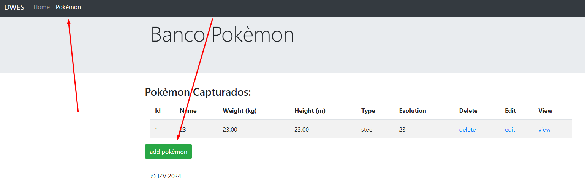
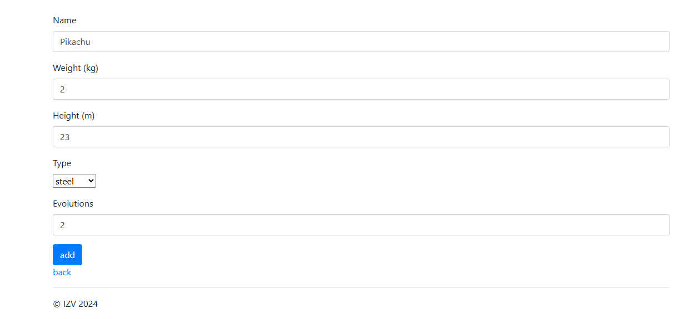
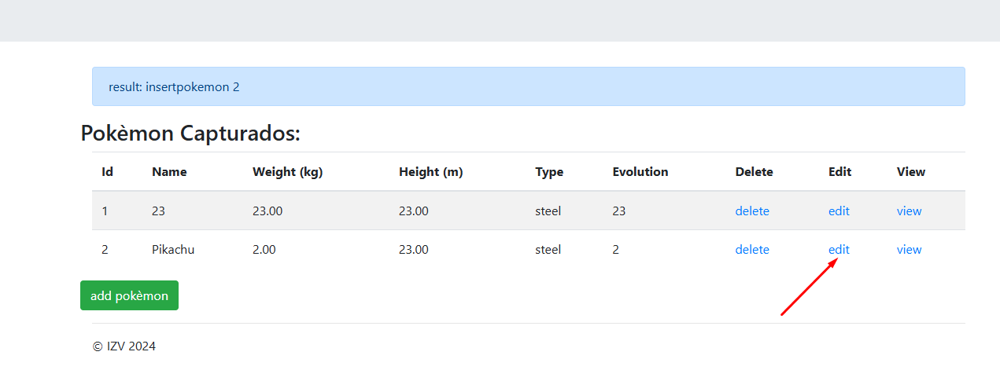
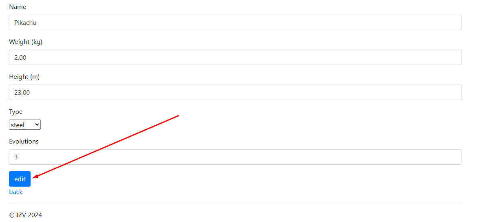
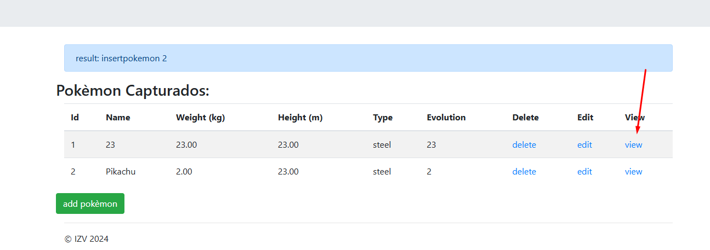
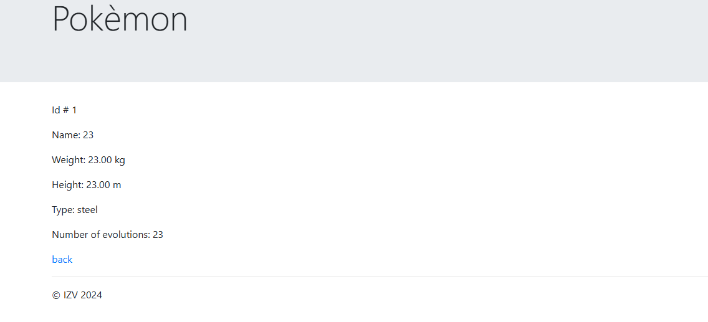
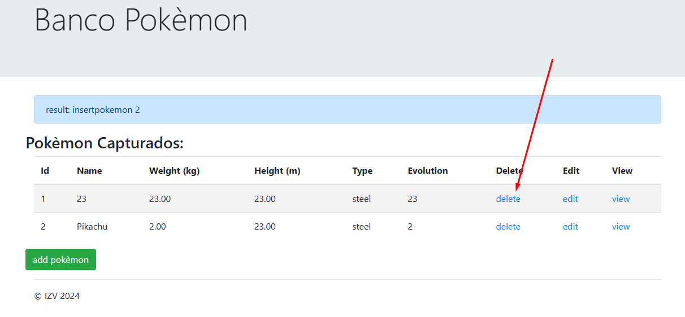
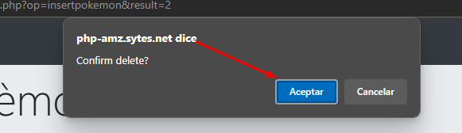

# 1. Logearse
Le damos al botón de `Log in`.

# 2. Crear un pokemon
Vamos a Pokémon y le damos a `Add pokemon`.

Rellenamos los campos y tras eso le damos a `add`.

# 3. Editar
Le damos al botón `edit`.

Y hacamos los cambios que queremos y le damos a `edit`.

# 4. Ver a un pokémon
Le damos a `view`.

Y podremos ver sus valores.

# 5. Eliminar un pokemon
Le damos al botón `delete`.

Y después le damos a `Aceptar`.

