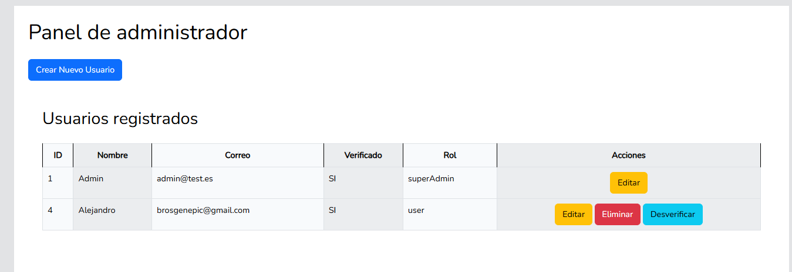
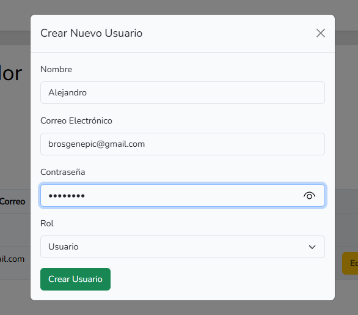
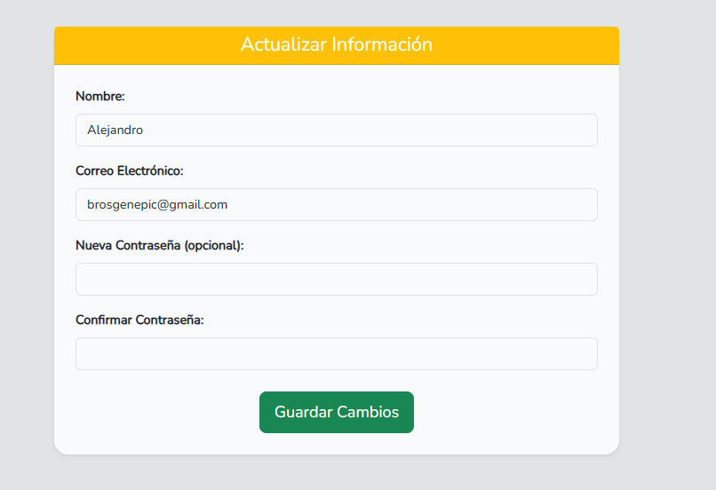

# User App

### 1. Registrar


### 2. Logearse


### 3. Panel de administrador


### 4. Editar usuario


### 7. Crear usuario


### 5. Panel de user


## Instalación

1. Clona el repositorio:
    ```sh
    git clone https://github.com/Mariortega83/userManagement
    ```

2. Instala las dependencias:

    ```sh
    composer install
    npm install
    npm run build
    ```

3. Configura el archivo [.env]:
    Tendremos que modificar el archivo `.env` con las configuraciones de la DB y credenciales de correo electrónico.
    ```sh
    cp .env.example .env
    php artisan key:generate
    ```

4. Ejecuta las migraciones:
    ```sh
    php artisan migrate
    ```
